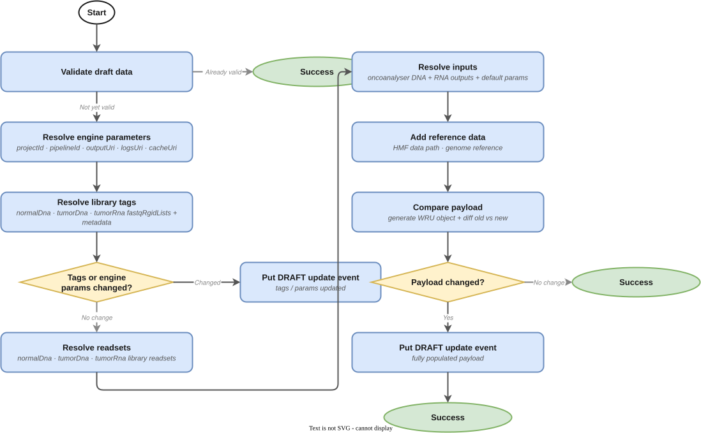
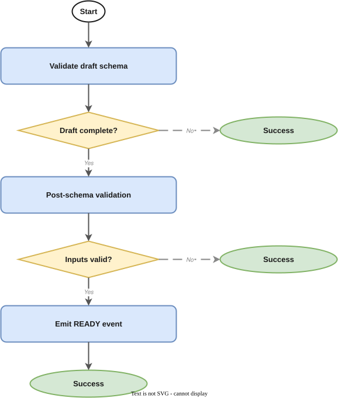
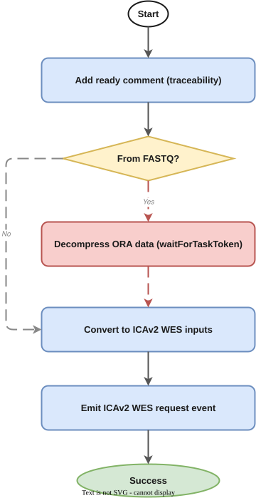
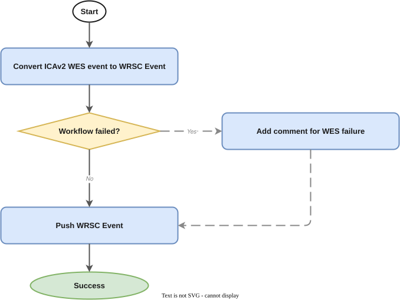

# Oncoanalyser WGTS Both Pipeline Manager

- [Overview](#overview)
- [Pipeline State Flow](#pipeline-state-flow)
  - [1. DRAFT → populated DRAFT](#1-draft--populated-draft)
  - [2. Populated DRAFT → READY](#2-populated-draft--ready)
  - [3. READY → ICAv2 submission](#3-ready--icav2-submission)
  - [4. ICAv2 state changes → WorkflowRunUpdate events](#4-icav2-state-changes--workflowrunupdate-events)
  - [5. Upstream SUCCEEDED → DRAFT update (glue)](#5-upstream-succeeded--draft-update-glue)
- [Event Contract](#event-contract)
  - [Consumed Events](#consumed-events)
  - [Published Events](#published-events)
- [Draft Event Payload](#draft-event-payload)
  - [Minimal DRAFT event detail](#minimal-draft-event-detail)
  - [Auto-populated Fields](#auto-populated-fields)
  - [Schema Validation](#schema-validation)
- [Submitting a Draft Event](#submitting-a-draft-event)
- [Infrastructure](#infrastructure)
  - [Stateful Resources](#stateful-resources)
  - [Stateless Resources](#stateless-resources)
  - [Stacks](#stacks)
- [CI/CD and Release Management](#cicd-and-release-management)
- [Related Services](#related-services)
- [SOPs](#sops)
- [Glossary & References](#glossary--references)

---

## Overview

This service manages the lifecycle of the **Oncoanalyser WGTS Both pipeline** — a combined somatic DNA+RNA analysis pipeline that integrates results from both DNA and RNA Oncoanalyser workflows, performing joint variant interpretation, fusion prioritisation, and comprehensive reporting using the Oncoanalyser/LINX/PURPLE/CUPPA/ORANGE toolchain on ICAv2.

The pipeline runs on [ICAv2](https://help.ica.illumina.com/) via CWL. Orchestration follows the standard [ICAv2-centric Pipeline Architecture](https://github.com/OrcaBus/wiki/blob/main/orcabus-platform/README.md#pipeline-orchestration-general-logic).

This is a **downstream service** — it depends on the successful completion of both the Oncoanalyser WGTS DNA and Oncoanalyser WGTS RNA pipelines (via glue state machines) to obtain their analysis outputs as inputs.

**Upstream**: [Oncoanalyser WGTS DNA](https://github.com/OrcaBus/service-oncoanalyser-wgts-dna-pipeline-manager), [Oncoanalyser WGTS RNA](https://github.com/OrcaBus/service-oncoanalyser-wgts-rna-pipeline-manager)
**Downstream**: [Sash](https://github.com/OrcaBus/service-sash-pipeline-manager), [RNAsum](https://github.com/OrcaBus/service-rnasum-pipeline-manager)

---

## Pipeline State Flow

The service orchestrates five Step Functions state machines that together drive a workflow run from initial DRAFT submission through to ICAv2 execution and result reporting.

### 1. DRAFT → populated DRAFT

**State machine**: [`populate_draft_data_sfn_template`](app/step-functions-templates/populate_draft_data_sfn_template.asl.json)



When a `WorkflowRunStateChange` DRAFT event arrives, this state machine populates any missing payload fields by resolving defaults from SSM and querying upstream services:

1. **Resolve engine parameters** — `projectId`, `pipelineId`, `outputUri`, `logsUri` from SSM or provided values
2. **Resolve tags** — library metadata, subject IDs from upstream services
3. **Emit a DRAFT update event** if tags or engine parameters changed
4. **Resolve inputs** — collects outputs from upstream Oncoanalyser WGTS DNA and RNA workflows
5. Emits a final DRAFT update event with the fully populated payload

### 2. Populated DRAFT → READY

**State machine**: [`validate_draft_data_and_put_ready_event_sfn_template`](app/step-functions-templates/validate_draft_data_and_put_ready_event_sfn_template.asl.json)



1. **Schema validation** — validates against the registered AWS Schemas registry entry
2. **Post-schema validation** — business-rule checks (engine parameters, URIs, input accessibility)
3. **Push READY event** — emits a `WorkflowRunStateChange` READY event

### 3. READY → ICAv2 submission

**State machine**: [`ready_event_to_icav2_wes_request_event_sfn_template`](app/step-functions-templates/ready_event_to_icav2_wes_request_event_sfn_template.asl.json)



Converts a READY event into an `Icav2WesRequest` event for the ICAv2 WES Manager to launch the CWL analysis.

### 4. ICAv2 state changes → WorkflowRunUpdate events

**State machine**: [`icav2_wes_event_to_wrsc_event_sfn_template`](app/step-functions-templates/icav2_wes_event_to_wrsc_event_sfn_template.asl.json)



Listens for `Icav2WesAnalysisStateChange` events and converts them into `WorkflowRunUpdate` events.

### 5. Upstream SUCCEEDED → DRAFT update (glue)

**State machine**: [`glue_succeeded_events_to_draft_update_sfn_template`](app/step-functions-templates/glue_succeeded_events_to_draft_update_sfn_template.asl.json)


When an upstream Oncoanalyser WGTS DNA or RNA pipeline succeeds, this state machine finds matching DRAFT runs for this service and merges the upstream outputs into their payloads.

---

## Event Contract

### Consumed Events

| DetailType | Source | Description |
|---|---|---|
| `WorkflowRunStateChange` | `orcabus.workflowmanager` | DRAFT and READY workflow run records |
| `Icav2WesAnalysisStateChange` | `orcabus.icav2wesmanager` | ICAv2 analysis state updates |
| `WorkflowRunStateChange` | `orcabus.workflowmanager` | Upstream SUCCEEDED events (oncoanalyser-wgts-dna, oncoanalyser-wgts-rna) |

### Published Events

| DetailType | Source | Description |
|---|---|---|
| `WorkflowRunUpdate` | `orcabus.oncoanalyserwgtsboth` | Pipeline state updates (DRAFT, READY, running, succeeded…) |
| `Icav2WesRequest` | `orcabus.oncoanalyserwgtsboth` | ICAv2 WES submission request |

---

## Draft Event Payload

A DRAFT event can be submitted with a minimal `data` payload — the populate state machine resolves all defaults. The final validated payload must satisfy the [complete-data draft schema](app/event-schemas/complete-data-draft/2025.08.05/complete-data-draft-schema.json).

### Minimal DRAFT event detail

```json
{
  "status": "DRAFT",
  "workflowName": "oncoanalyser-wgts-dna-rna",
  "workflowVersion": "2.2.0",
  "workflowRunName": "umccr--automated--oncoanalyser-wgts-dna-rna--2-2-0--<portalRunId>",
  "portalRunId": "<portalRunId>",
  "linkedLibraries": [
    { "libraryId": "L2300950", "orcabusId": "lib.01..." },
    { "libraryId": "L2300943", "orcabusId": "lib.02..." },
    { "libraryId": "L2300951", "orcabusId": "lib.03..." }
  ]
}
```

The `linkedLibraries` array includes the tumor DNA library, normal DNA library, and tumor RNA library.

### Auto-populated Fields

All of the following are resolved by the populate state machine if not explicitly provided:

| Field | Resolved from |
|---|---|
| `engineParameters.projectId` | SSM: default ICAv2 project for the environment |
| `engineParameters.pipelineId` | SSM: pipeline ID map keyed by workflow version |
| `engineParameters.outputUri` | SSM: output prefix + `portalRunId` |
| `engineParameters.logsUri` | SSM: logs prefix + `portalRunId` |
| `tags.libraryId` | From `linkedLibraries` (normal DNA entry) |
| `tags.tumorLibraryId` | From `linkedLibraries` (tumor DNA entry) |
| `tags.rnaLibraryId` | From `linkedLibraries` (tumor RNA entry) |
| `inputs.oncoanalyserDnaOutputs` | Upstream Oncoanalyser WGTS DNA SUCCEEDED outputs |
| `inputs.oncoanalyserRnaOutputs` | Upstream Oncoanalyser WGTS RNA SUCCEEDED outputs |

### Schema Validation

The complete-data schema is registered in the AWS Schemas registry and used for validation before promotion to READY.

---

## Submitting a Draft Event

To manually submit an Oncoanalyser WGTS Both DRAFT event (e.g. to trigger a reanalysis), follow:

- [PM.OWB.1 — Manual Pipeline Execution](docs/operation/SOP/PM.OWB.1/PM.OWB.1-ManualPipelineExecution.md)

See the [full SOPs index](docs/operation/SOP/README.md) for all operational procedures including deployment, parameter updates, and troubleshooting.

---

## Infrastructure

The service is deployed via AWS CDK. Resources are split into two stacks: stateful (data/config) and stateless (compute/events).

All SSM parameters live under `/orcabus/workflows/oncoanalyser-wgts-dna-rna/`.
Event bus: `OrcaBusMain`
Event source: `orcabus.oncoanalyserwgtsboth`

### Stateful Resources

**AWS Schemas registry**
- `complete-data-draft-schema.json` — used to validate DRAFT payloads before promotion to READY

**SSM Parameters**

| Parameter | Description |
|---|---|
| `workflow-name` | `oncoanalyser-wgts-dna-rna` |
| `default-workflow-version` | Current default version (e.g. `2.2.0`) |
| `payload-version` | Payload schema version |
| `icav2-project-id` | Default ICAv2 project ID per environment |
| `logs-prefix` | Default S3 prefix for logs |
| `output-prefix` | Default S3 prefix for outputs |
| `cache-prefix` | Default S3 prefix for cache |
| `pipeline-ids-by-workflow-version/<version>` | ICAv2 CWL pipeline ID for each workflow version |
| `inputs-by-workflow-version/<version>` | Default input overrides per workflow version |
| `default-hmf-reference-paths-by-workflow-version/<version>` | Default HMF reference paths |

### Stateless Resources

- **Lambda functions** (Python 3.14, ARM64) — one per task in the state machines; see [`app/lambdas/`](app/lambdas/)
- **Step Functions state machines** — five ASL templates in [`app/step-functions-templates/`](app/step-functions-templates/)
- **EventBridge rules** — route incoming `WorkflowRunStateChange` (DRAFT, READY, upstream SUCCEEDED) and `Icav2WesAnalysisStateChange` events to the appropriate state machines

### Stacks

The CDK project deploys a CodePipeline in the toolchain account that promotes changes to `beta`, `gamma`, and `prod`.

```sh
# List stateful stacks
pnpm cdk-stateful ls

# List stateless stacks
pnpm cdk-stateless ls
```

---

## CI/CD and Release Management

All changes merged to `main` are automatically built and deployed to `beta` and `gamma`. Promotion to `prod` requires manually enabling the CodePipeline transition in the AWS console.

---

## Related Services

| Role | Service |
|---|---|
| Upstream | [Oncoanalyser WGTS DNA](https://github.com/OrcaBus/service-oncoanalyser-wgts-dna-pipeline-manager) |
| Upstream | [Oncoanalyser WGTS RNA](https://github.com/OrcaBus/service-oncoanalyser-wgts-rna-pipeline-manager) |
| Downstream | [Sash](https://github.com/OrcaBus/service-sash-pipeline-manager) |
| Downstream | [RNAsum](https://github.com/OrcaBus/service-rnasum-pipeline-manager) |
| ICAv2 execution | [ICAv2 WES Manager](https://github.com/OrcaBus/service-icav2-wes-manager) |
| Workflow state | [Workflow Manager](https://github.com/OrcaBus/service-workflow-manager) |

---

## SOPs

| SOP | Description |
|---|---|
| [PM.OWB.1](docs/operation/SOP/PM.OWB.1/PM.OWB.1-ManualPipelineExecution.md) | Manually kick off a reanalysis |
| [PM.OWB.2](docs/operation/SOP/PM.OWB.2/PM.OWB.2-NewPipelineDeployment.md) | Install and deploy a new pipeline version |
| [PM.OWB.3](docs/operation/SOP/PM.OWB.3/PM.OWB.3-UpdatingPipelineParameters.md) | Update SSM parameters |
| [PM.OWB.4](docs/operation/SOP/PM.OWB.4/PM.OWB.4-RunningWorkflowValidations.md) | Run workflow validations |
| [PM.OWB.5](docs/operation/SOP/PM.OWB.5/PM.OWB.5-TroubleShooting.md) | Troubleshoot common issues |

---

## Glossary & References

- Platform glossary: [OrcaBus wiki](https://github.com/OrcaBus/wiki/blob/main/orcabus-platform/README.md#glossary--references)
- For development setup, build commands, project structure, and conventions see the [steering docs](.kiro/steering/).
